
  

 

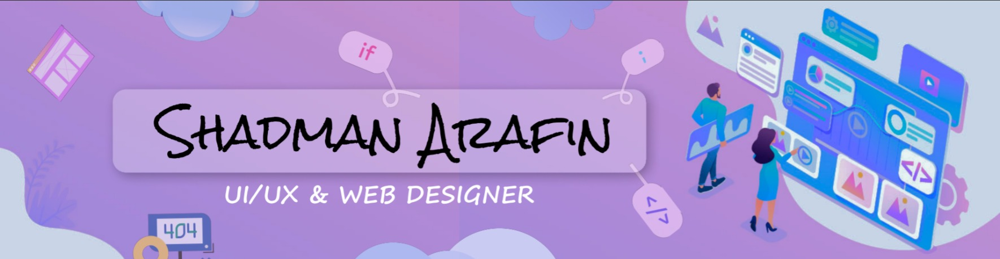

<h3 align="center">A passionate 📱 UI/UX & Web Designer 👨‍🎨 and a recent 👨‍🎓 graduate 🎓 who's looking for an opportunity.</h3>

  

- 🔭 I’m currently working on <i><b>My Personal Website 💻 in Wordpress 🔤</b></i>

- 🌱 I’m currently learning <i><b>Unity & Unreal Engine ⚙</b></i>

- 👯 I’m looking to collaborate on <i><b>UI/UX & Web Design 🎨</b></i>

- 👨‍💻 All of my projects are available at : &nbsp;  &nbsp;  &nbsp;  

- 📫  You can contact me at : &nbsp;  <i><b> - shadmanarafinsezan@gmail.com </b></i>

- 📄  Know about my experiences from : &nbsp;  

 

<h2 align="left">Languages and Skills 🛠 :</h2> 

 

 
 &nbsp;
 &nbsp;
 &nbsp;
 &nbsp;
 &nbsp;
 &nbsp;
 &nbsp;
 &nbsp;
 &nbsp;
 &nbsp;
 &nbsp;
 &nbsp;
 &nbsp;
 &nbsp;
 &nbsp;
 &nbsp; 

  

<h2><align="left">My Resume:</h2>

<h4>If you want to know more about myself then you can download my full Resume by clicking the "Download Resume" button from below 👇🏻</h4> 
<a href="https://drive.google.com/file/d/1bLHj3KjYsuHWh9tf5WVpzLCgmb4m-ziJ/view?usp=sharing">

</a>
 
 
  

<i><b><h1 align="center">Personal Projects Showcase 📽</h1></b></i>
 
  
 
<h2>1. Online Shopping - Mobile App UI Design</h2>
<h6>Click on the project screen-shots below to watch the LIVE DEMO 👇🏻👇🏽</h6>

<a href="https://www.behance.net/gallery/138419467/Online-Shopping-Mobile-App-UI-Design">
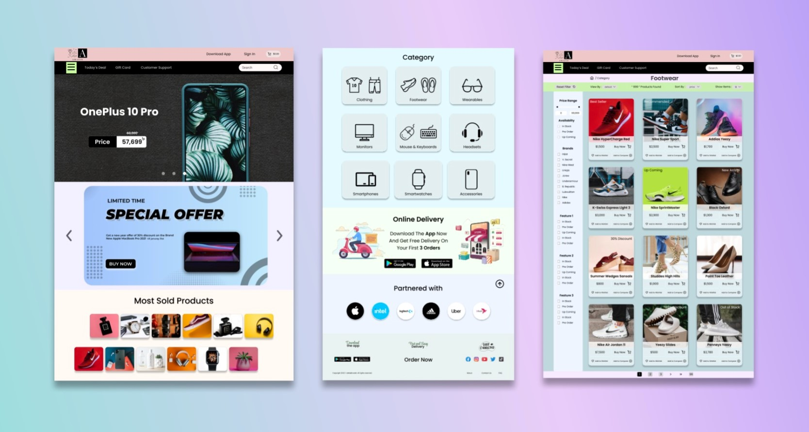
</a>

   
 
<h2>2. Food Delivery - Mobile App UI Design</h2>
<h6>Click on the project screen-shots below to watch the LIVE DEMO 👇🏻👇🏽</h6>

<a href="https://www.behance.net/gallery/138419245/Food-Delivery-Mobile-App-UI-Design">
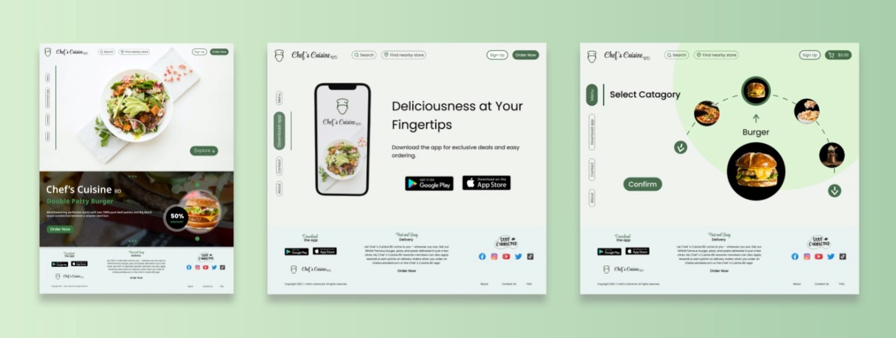
</a>

   
 
<h2>3. Restaurant - Website UI Design</h2>
<h6>Click on the project screen-shots below to watch the LIVE DEMO 👇🏻👇🏽</h6>

   

<h2>4. E-commerce - Website UI Design</h2>
<h6>Click on the project screen-shots below to watch the LIVE DEMO 👇🏻👇🏽</h6>

   

<h2>5. Fitness App - Dashboard UI Design with Dark Mode Switch</h2>
<h6>Click on the project screen-shots below to watch the LIVE DEMO 👇🏻👇🏽</h6>
<a href="https://www.behance.net/gallery/138415907/Fitness-App-Dashboard-UI-Design-with-Dark-Mode-Switch">
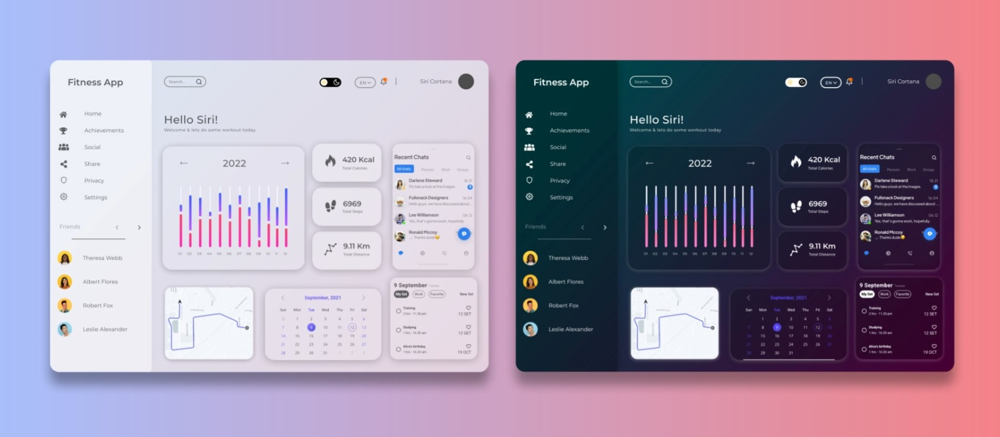
</a>

   
<h2>6. Animated Web Design</h2>

<h3>Parallax Effect</h3>
<h6>Click on the project screen-shots below to watch the LIVE DEMO 👇🏻👇🏽</h6>

<a href="https://www.behance.net/gallery/138411119/Parallax-Effect-Animated-Web-Design">
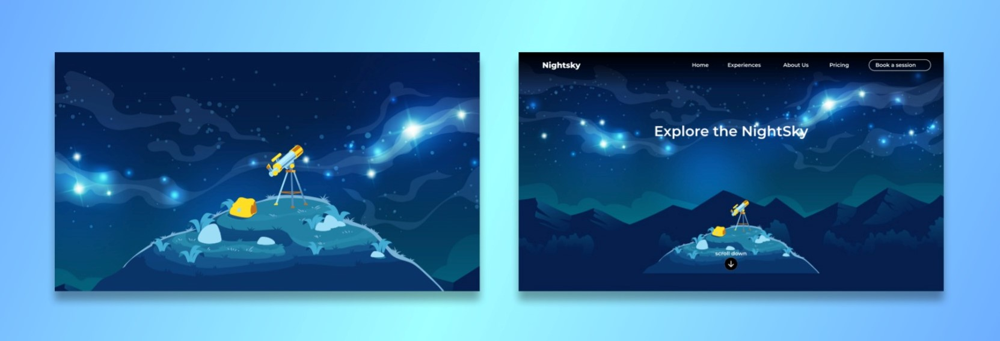
</a>

   
<h3>Sliding Effect</h3>
<h6>Click on the project screen-shots below to watch the LIVE DEMO 👇🏻👇🏽</h6>

<a href="https://www.behance.net/gallery/138410763/Sliding-Effect-Animated-Web-Design">
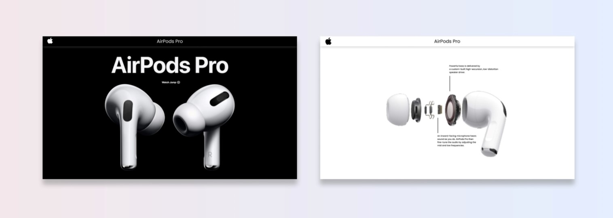
</a>

   
<h2>7. Landing Page - Web Design</h2>

<h6>Click on the project screen-shots below to watch the LIVE DEMO 👇🏻👇🏽</h6>

<a href="https://www.behance.net/gallery/138410433/Landing-Page-Web-Design">
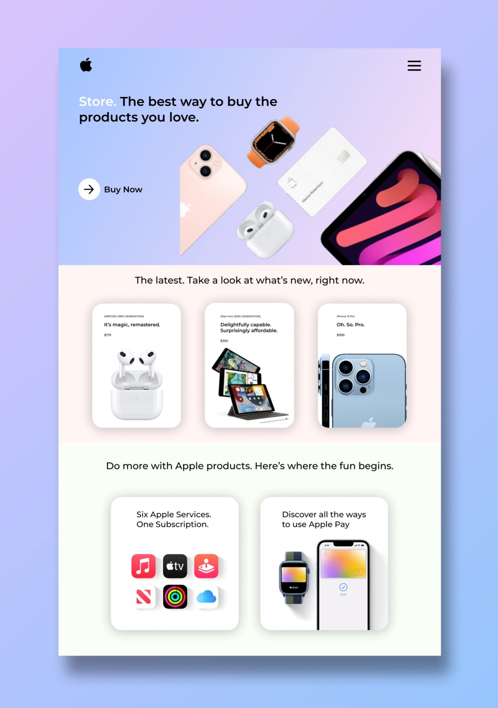
</a>

   

<h2>8. Product Sale Ad Banners Design</h2>
<h6>Click on the project screen-shots below to view the Full Detailed Images 👇🏻👇🏽</h6>

<a href="https://www.behance.net/gallery/138408709/Product-Sale-Ad-Banners-Design">
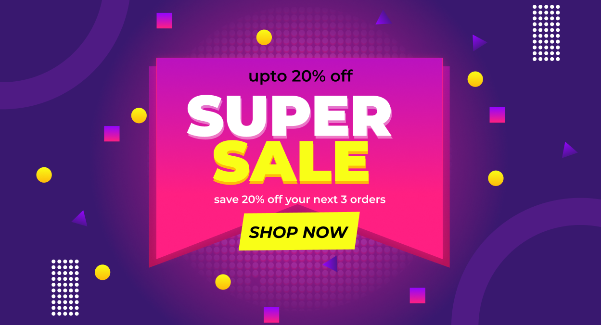</a>
&nbsp;&nbsp;&nbsp;
<a href="https://www.behance.net/gallery/138408709/Product-Sale-Ad-Banners-Design">
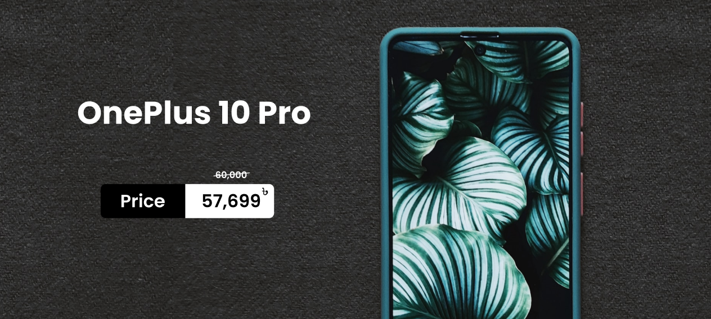</a>
&nbsp;&nbsp;&nbsp;
<a href="https://www.behance.net/gallery/138408709/Product-Sale-Ad-Banners-Design">
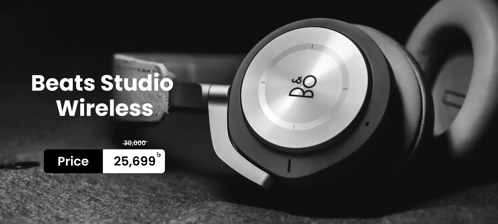</a>
&nbsp;&nbsp;&nbsp;
<a href="https://www.behance.net/gallery/138408709/Product-Sale-Ad-Banners-Design">
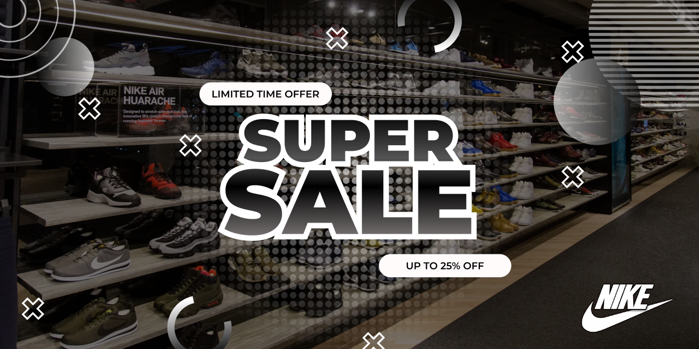</a>
&nbsp;&nbsp;&nbsp;

 
