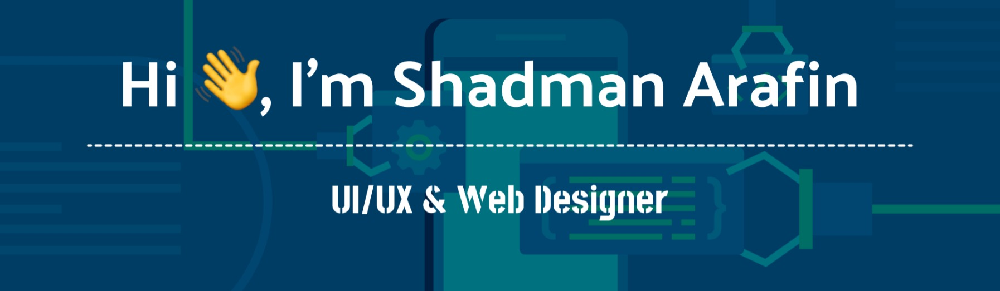
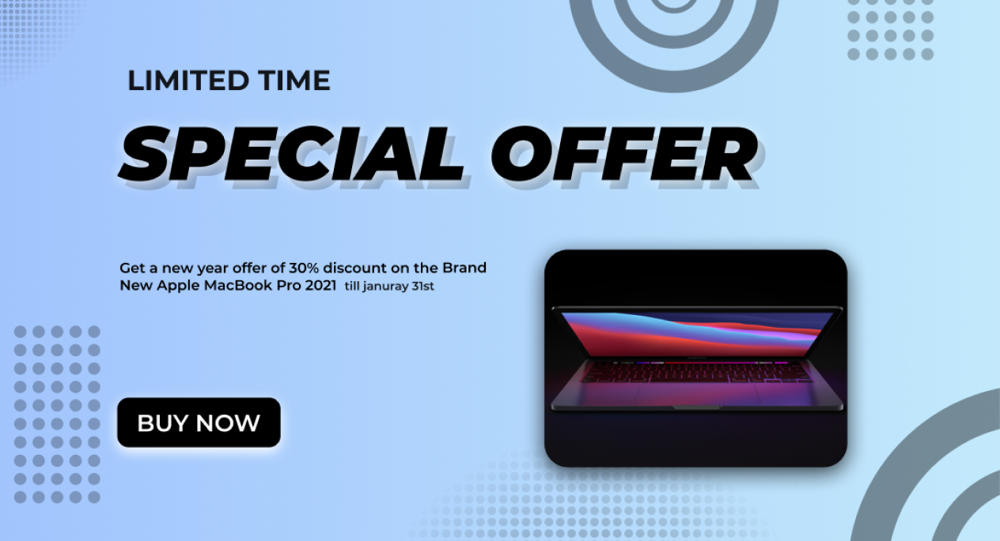
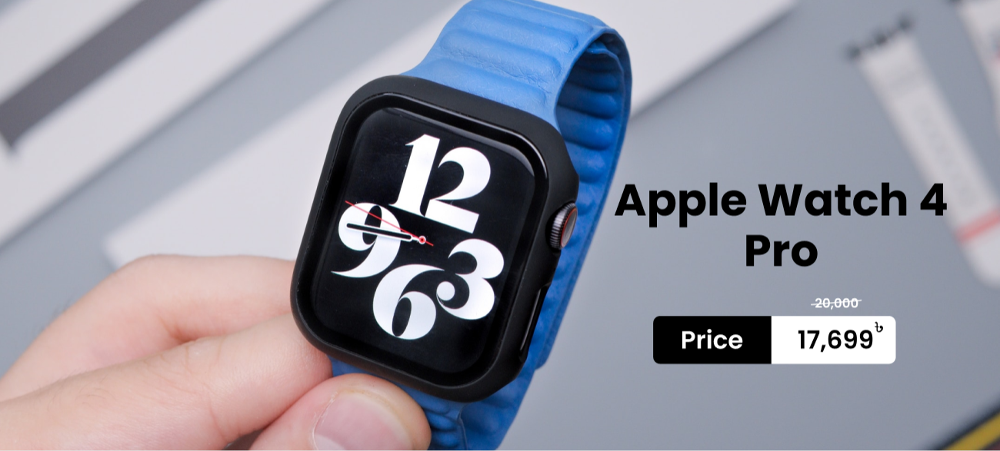

  

<h3 align="center">A passionate UI/UX & Web Designer and a recent graduate who's looking for an opportunity.</h3>

- 🔭 I’m currently working on **My Personal Website in Wordpress.**

- 🌱 I’m currently learning **Unity & Unreal Engine.**

- 👯 I’m looking to collaborate on **UI/UX & Web Design.**

- 👨‍💻 All of my projects are available at : 
 **github.com/ShadmanArafin**

- 📫  You can contact me at :  **shadmanarafinsezan@gmail.com**

- 📄  Know about my experiences from :  **linkedin.com/in/shadmanarafin**

<h3 align="left">Languages and Tools:</h3>

                           

&nbsp;

  
<h1 align="center">Projects</h1>

  
<h2>1. E-commerce Website UI Design</h2>
<h6>Click on the project screen-shots to see the LIVE DEMO 👇🏻👇🏽</h6>

   
<h2>2. Chef's Cuisine Website UI Design</h2>
<h6>Click on the project screen-shots to see the LIVE DEMO 👇🏻👇🏽</h6>

   
<h2>3. Apple Landing Page Design</h2>

<h6>Click on the project screen-shots to see the LIVE DEMO 👇🏻👇🏽</h6>

   
<h2>4. Animated Webpage Design</h2>

<h3>Parallax Effect</h3>
<h6>Click on the project screen-shots to see the LIVE DEMO 👇🏻👇🏽</h6>

   
<h3>Slide Effect</h3>
<h6>Click on the project screen-shots to see the LIVE DEMO 👇🏻👇🏽</h6>

   
<h2>5. Dashboard Design (Dark Mode)</h2>
<h6>Click on the project screen-shots to see the LIVE DEMO 👇🏻👇🏽</h6>

   
<h2>6. Promotional/Sale Banner Design</h2>
<h6>Click on the project screen-shots to see the Full Detailed Images 👇🏻👇🏽</h6>

 &nbsp;&nbsp;&nbsp;

 &nbsp;&nbsp;&nbsp;

 &nbsp;&nbsp;&nbsp;

 &nbsp;&nbsp;&nbsp;

  &nbsp;&nbsp;&nbsp;

 

