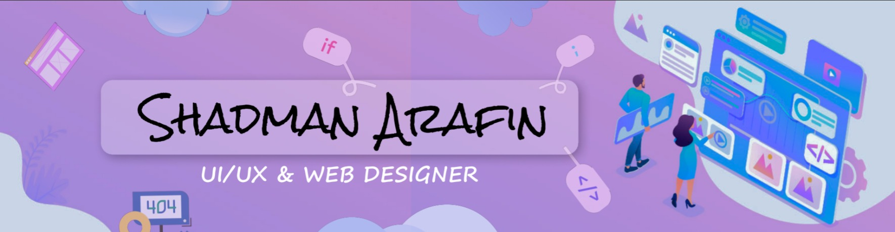
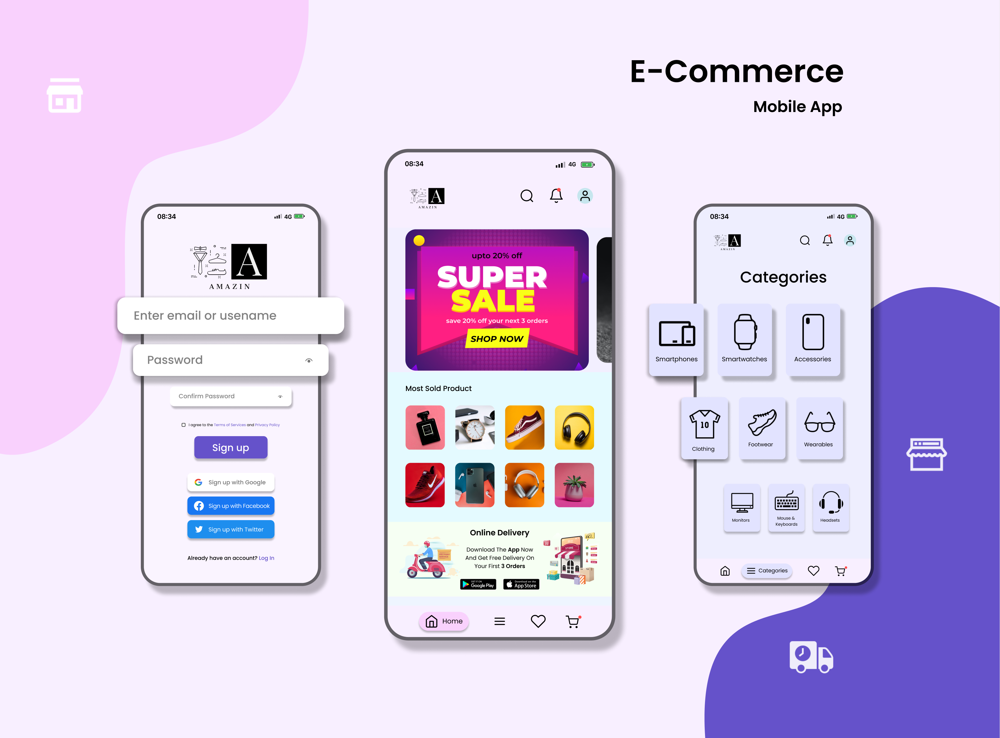
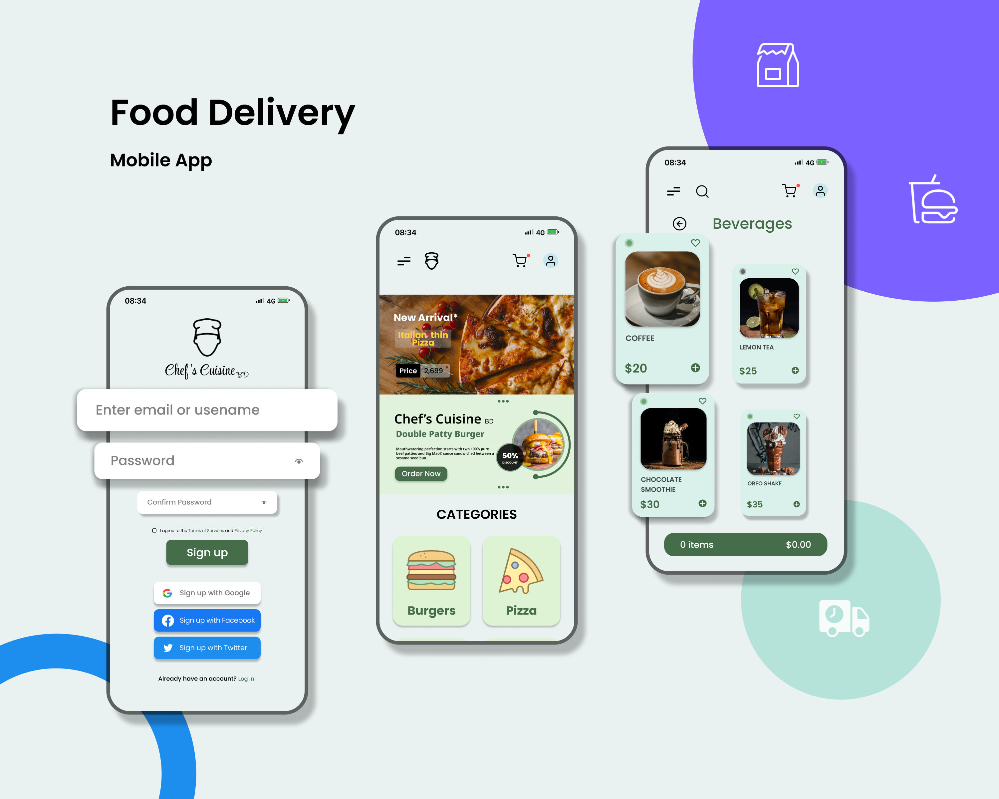
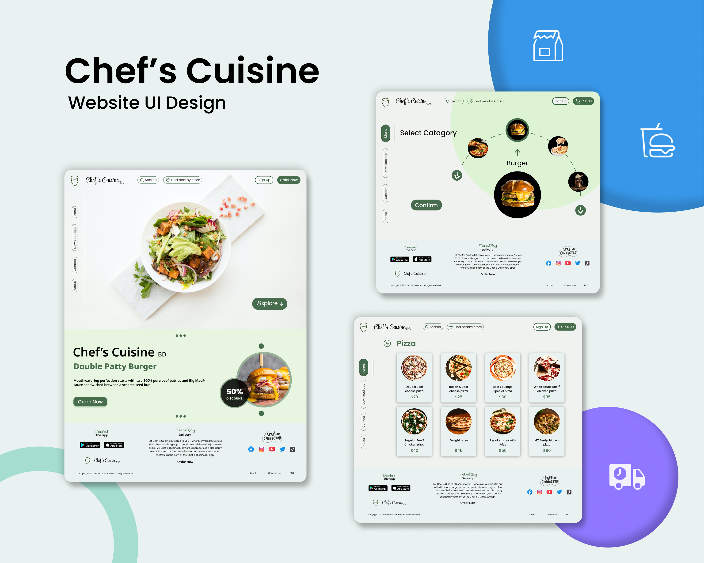
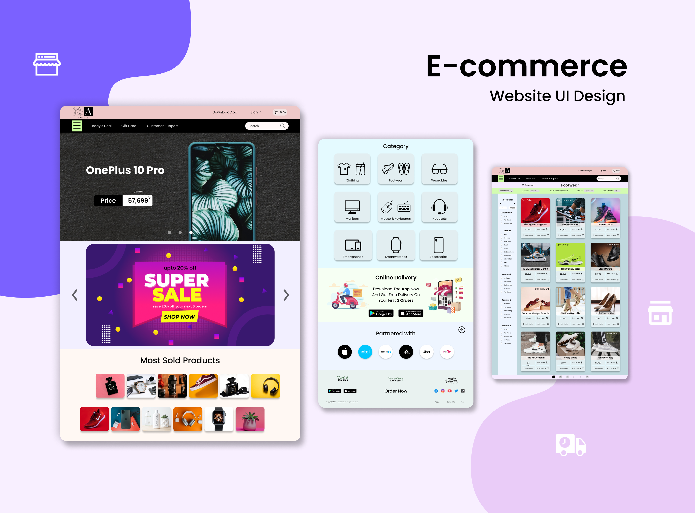

  

 

<h3 align="center"><i><b>UI/UX, Web & Product Designer</b></i>.</h3>

  

- 🔭 I’m currently working as a UI/UX Designer at <a href="https://www.zaagsys.com/"><i><b>Zaag Systems ltd.</b></i></a>
- 🌱 I’m currently learning <i><b>Webflow & Framer.</b></i>

- 👯 I’m looking to collaborate on <i><b>UI/UX & Web Design 🎨</b></i>

- 👨‍💻 All of my projects are available at :  &nbsp;  &nbsp;  

- 📫  You can contact me at : &nbsp;  <i><b> - shadmanarafinsezan@gmail.com </b></i>

- 📄  Know about my experiences from : &nbsp;  

- Visit My website to learn more - <a href="https://shadmanarafin.netlify.app"><i><b>ShadmanArafin</b></i></a>

 

<h2 align="left">Languages and Skills 🛠 :</h2> 

 

 
 &nbsp;
 &nbsp;
 &nbsp;&nbsp;
 &nbsp;

  

<h2><align="left">My Resume :</h2>

<h4>If you want to know more about myself, then you can download my full Resume by clicking the <i><b>"Download Resume"</b></i> button from below 👇🏻</h4> 
<a href="https://drive.google.com/file/d/1VDjtQ0bUJQSc1OXbeBSC9RJ9zQv88NQx/view?usp=sharing">

</a>
 
 
  

<i><b><h1 align="center">Personal Projects Showcase 📽</h1></b></i>
 
  
 
<h2>1. Online Shopping - Mobile App UI Design</h2>
<h6>Click on the thumbnail image below to see the complete LIVE Preview of this project 👇👇🏻</h6>

   
 
<h2>2. Food Delivery - Mobile App UI Design</h2>
<h6>Click on the thumbnail image below to see the complete LIVE Preview of this project 👇👇🏻</h6>

   
 
<h2>3. Restaurant - Website UI Design</h2>
<h6>Click on the thumbnail image below to see the complete LIVE Preview of this project 👇👇🏻</h6>

   

<h2>4. E-commerce - Website UI Design</h2>
<h6>Click on the thumbnail image below to see the complete LIVE Preview of this project 👇👇🏻</h6>

   

<h2>5. Fitness App - Dashboard UI Design with Dark Mode Switch</h2>
<h6>Click on the thumbnail image below to see the complete LIVE Preview of this project 👇👇🏻</h6>

   
<h2>6. Animated Web Design</h2>

<i><b><h3>Parallax Effect</h3></b></i>
<h6>Click on the thumbnail image below to see the complete LIVE Preview of this project 👇👇🏻</h6>

   
<i><b><h3>Sliding Effect</h3></b></i>
<h6>Click on the thumbnail image below to see the complete LIVE Preview of this project 👇👇🏻</h6>

   

 
